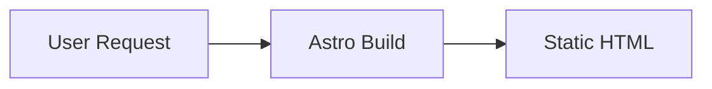

## The starting point

I've built plenty of sites with [Next.js](https://nextjs.org/) and React over the years. They're great for complex web apps, but for a personal portfolio? It always felt like bringing a tank to a knife fight. Every Next.js portfolio I made shipped hundreds of kilobytes of JavaScript just to render what's essentially static text and images.

So when I decided to rebuild my personal site, I set myself a challenge: **make it as fast as physically possible.** Not "fast enough" — actually fast. Sub-second load times. A Lighthouse score as close to 100 as I could get. And do it while keeping the design clean, minimal, and pleasant to read.

This post is about how that went — the choices I made, the things that surprised me, and the gotchas I ran into along the way.

## Why my usual stack wouldn't cut it

My go-to stack for most projects is something like Next.js , Tailwind, and Vercel or Netlify. It's productive, well-documented, and familiar. But for a static portfolio, it has downsides:

- **JavaScript overhead** — React alone ships ~40KB gzipped. Add a framework, a router, and some hydration logic, and you're easily at 150KB+ of JS before you've written a single line of your own code.
- **Hydration cost** — Even with SSG, React still "hydrates" on the client, meaning the browser downloads, parses, and executes JavaScript to attach event handlers to already-rendered HTML.
- **Overkill for content** — A portfolio is mostly text and images. You don't need state management, client-side routing, or a virtual DOM for that.

I wanted something that would generate pure HTML and CSS at build time, with **zero JavaScript by default**, and only add JS when I explicitly chose to.

## The stack I landed on

After some research, here's what I went with:

| Layer         | Choice                                                             | Why                                                     |
| ------------- | ------------------------------------------------------------------ | ------------------------------------------------------- |
| **Framework** | [Astro 5](https://astro.build/)                                    | Static-first, zero JS by default, great content support |
| **Styling**   | [Tailwind CSS v4](https://tailwindcss.com/)                        | Utility-first, CSS-only output, new CSS-based config    |
| **Search**    | [Pagefind](https://pagefind.app/)                                  | Static search index, tiny runtime (~6KB), no backend    |
| **Fonts**     | [Raleway](https://fonts.google.com/specimen/Raleway) (self-hosted) | Free, geometric, Proxima Nova feel with OpenType tweaks |
| **CMS**       | [PageCMS](https://pagescms.org/)                                   | Git-based, lightweight, no vendor lock-in               |
| **Hosting**   | [Netlify](https://www.netlify.com/)                                | Global CDN, auto-deploys from GitHub, free tier         |
| **Runtime**   | [Bun](https://bun.sh/)                                             | Fast installs, fast builds, drop-in Node replacement    |

Let me walk through the interesting decisions.

### Astro: the right tool for the job

[Astro](https://astro.build/) is built specifically for content-heavy sites. Its "island architecture" means components are static HTML by default — you only opt into JavaScript when a specific component needs interactivity. For my portfolio, that means **zero client-side JS** on most pages.

What I particularly liked:

- **Content Collections** with [Zod](https://zod.dev/) schema validation at build time — if a blog post is missing a required field, the build fails. No surprises in production.
- **Markdown-first** — I write content in `.md` files with frontmatter, and Astro handles rendering. Code blocks get [Shiki](https://shiki.style/) syntax highlighting at build time, so no JS needed for that either.
- **File-based routing** — `src/pages/about.astro` becomes `/about`. Simple.

```typescript
// Content is type-safe thanks to Zod schemas
const projects = defineCollection({
  loader: glob({ pattern: "**/*.md", base: "./src/content/projects" }),
  schema: ({ image }) =>
    z.object({
      title: z.string().min(1),
      description: z.string().min(10),
      date: z.coerce.date(),
      techStack: z.array(z.string()),
      heroImage: image().optional(),
      featured: z.boolean().default(false),
    }),
});
```

### Tailwind v4: a big shift from v3

I'd been using Tailwind v3 with a `tailwind.config.ts` file for years. [Tailwind v4](https://tailwindcss.com/blog/tailwindcss-v4) changes everything. The configuration moves from JavaScript to CSS using the `@theme` directive:

```css
@import "tailwindcss";

@theme {
  --color-accent: #B54D1A;
  --text-base: 1.25rem;
  --font-sans: "Raleway", "Inter", system-ui, sans-serif;
  --spacing-base: 20px;
  --radius-base: 8px;
}
```

No more `tailwind.config.ts`. No more `content: []` paths (auto-detected now). It's cleaner, but the migration had its quirks — more on that below.

### Raleway: getting that Proxima Nova feel

I love the look of [Proxima Nova](https://www.marksimonson.com/fonts/view/proxima-nova), but it's a commercial font. [Raleway](https://fonts.google.com/specimen/Raleway) is free and geometrically similar, and with some [OpenType stylistic alternates](https://fonts.google.com/knowledge/glossary/stylistic_alternates), you can get surprisingly close:

```css
body {
  font-feature-settings:
    "ss01" 1,
    /* Single-story 'a' (like Proxima Nova) */ "ss03" 1,
    /* Alternate 'l' and 'i' */ "ss05" 1,
    /* More geometric 'G' */ "ss08" 1,
    /* Cleaner 'W' (no criss-cross) */ "ss09" 1,
    /* Lining numerals */ "ss11" 1; /* More geometric 'u' */
}
```

The `ss08` alternate was the biggest win — Raleway's default 'W' has a criss-cross in the middle that looks dated. The alternate is clean and modern.

I self-hosted the fonts as WOFF2 files (~57KB total for three weights) and preload the Regular and Bold weights in the `<head>` to avoid FOUT (Flash of Unstyled Text). I used [CloudConvert](https://cloudconvert.com/ttf-to-woff2) to convert from TTF to WOFF2.

### Bun: my first time ditching npm

I've had a bit of a journey with JavaScript package managers. I started with [Yarn](https://yarnpkg.com/) during a coding bootcamp — it was the recommended tool at the time, and the deterministic lockfile felt like a big deal compared to early npm. After the bootcamp, I settled into [npm](https://www.npmjs.com/) for everything. It was the default, it came with Node, and it just worked.

For this project, I decided to try [Bun](https://bun.sh/) — mostly out of curiosity, but also because it promised faster installs and builds. And honestly? The difference is noticeable.

**What I liked:**
- **Install speed** — `bun install` finishes in a fraction of the time `npm install` takes. On a fresh install, we're talking seconds instead of tens of seconds.
- **Drop-in replacement** — I didn't have to change any scripts. `bun run dev`, `bun run build` — it all just works. The `package.json` scripts are the same.
- **Built-in TypeScript support** — No separate `ts-node` or build step needed. Bun runs `.ts` files natively.
- **Single binary** — No separate Node install needed. Bun is the runtime, the package manager, and the bundler in one.

**The rough edges:**
- **Lockfile format** — Bun uses `bun.lock` (a binary format in earlier versions, now text-based). If you switch between npm and Bun in the same project, the lockfiles conflict. Pick one and stick with it.
- **Ecosystem compatibility** — Most npm packages work fine, but occasionally you'll hit a native module or a postinstall script that assumes Node. For this project it wasn't an issue, but I've heard of edge cases with more complex setups.
- **Netlify builds** — Netlify's build environment uses Node by default, not Bun. My `netlify.toml` uses `bun run build`, which works because Netlify does support Bun, but it's worth knowing that the build environment is still Node-based under the hood.

For a project like this — an Astro site with Tailwind and a few plugins — Bun is a clear win. The faster feedback loop during development adds up over a full project. I'd reach for it again on new projects, though for existing large codebases with complex native dependencies, I'd test more carefully before switching.

| | npm | Yarn | Bun |
|---|---|---|---|
| **Install speed** | Baseline | ~Same as npm | 2-5x faster |
| **Lockfile** | `package-lock.json` | `yarn.lock` | `bun.lock` |
| **Comes with Node** | Yes | No (separate install) | No (separate install) |
| **TypeScript** | Needs `ts-node` | Needs `ts-node` | Built-in |
| **Maturity** | Very mature | Mature | Newer, evolving fast |

## Challenges I didn't expect

### Tailwind v3 vs v4: different token namespaces

This one cost me a few hours. In Tailwind v4, the CSS variable names must follow specific naming conventions to generate the right utility classes:

- `--text-*` generates `text-*` utilities (font sizes) — NOT `--font-size-*`
- `--leading-*` generates `leading-*` utilities — NOT `--line-height-*`
- `--color-*` generates color utilities like `bg-*`, `text-*`, `border-*`
- `--spacing-*` generates spacing utilities like `p-*`, `m-*`, `gap-*`

If you name them wrong, the utilities simply don't exist and you get no error — your classes just silently do nothing. I initially used `--font-size-base` and spent time wondering why `text-base` wasn't working.

### Tailwind v4 + Astro: HMR gotcha

Another fun one: when you change values inside the `@theme` block in Tailwind v4, Hot Module Replacement doesn't always pick up the changes cleanly. You often need to restart the dev server and do a hard refresh. Not a big deal once you know, but confusing when you're tweaking your design tokens and nothing seems to update.

Also, **unlayered CSS overrides `@layer utilities`**. If you put a CSS reset or global styles in an Astro `<style is:global>` block without wrapping them in a `@layer`, they'll override your Tailwind utilities. Tailwind v4's Preflight handles resets, so you don't need your own.

### Astro 4 vs Astro 5: Content Layer API changes

I started with documentation written for Astro 4, but Astro 5 changed a few things in the Content Layer API:

- **Config file location** — `src/content.config.ts` (Astro 5) instead of `src/content/config.ts` (Astro 4)
- **Standalone `render()`** — You import `render` from `astro:content` directly, rather than calling `entry.render()`
- **`entry.id` not `entry.slug`** — Routes use `id` now
- **`z.coerce.date()`** — Required for parsing YAML date strings in frontmatter

Small changes, but if you're following a tutorial written for Astro 4, they'll trip you up.

### Image handling: `z.string()` vs `image()`

For project hero images, I initially used `z.string()` in the Zod schema. This treats the image path as a plain string, which means Astro doesn't process it — no optimization, no format conversion, and relative paths don't resolve correctly.

The fix was using Astro's `image()` helper in the schema:

```typescript
schema: ({ image }) =>
  z.object({
    heroImage: image().optional(),
  });
```

This tells Astro to resolve and optimize the image at build time, converting to AVIF/WebP and generating proper `src` attributes. Small change, big difference.

## Working with PageCMS: the trade-offs

I wanted a CMS for editing content without touching code, but I didn't want something heavy like WordPress or Contentful. [PageCMS](https://pagescms.org/) is a Git-based CMS — it reads your markdown files directly from your GitHub repo and commits changes back.

**What works well:**

- Edits your actual markdown files — no separate database
- Supports custom frontmatter fields
- Free for open-source projects
- No vendor lock-in — your content is always just `.md` files in Git

**The trade-offs:**

- **No live preview** — You can't see how your changes look on the actual site before deploying. pageCMS has a basic markdown preview, but it doesn't show your layout, styles, or components.
- **Every save triggers a build** — Each edit commits to GitHub, which triggers a Netlify build. On my Netlify plan, builds consume credits. Editing five blog posts means five builds.
- **Array fields need special syntax** — I had issues with `techStack` (an array of strings). pageCMS was saving it as a comma-separated string instead of a YAML array, which broke the Zod schema. The correct pageCMS field config is `type: string` with `list: true` — not `type: list`, which doesn't exist.
- **Media management is limited** — pageCMS only shows images it knows about. Images I pushed directly via Git didn't appear in the media browser, even though they were in the repo.

For a portfolio site where I edit content occasionally, these trade-offs are fine. For a frequently-updated blog, I'd probably want something with a richer editing experience.

## Markdown: powerful but with limits

Writing in markdown is genuinely nice for technical content. Code blocks render beautifully with Shiki syntax highlighting (at build time, no JavaScript), lists and headers just work, and the files are portable and version-controlled.

But there are limits. For instance, I wanted to include a [Mermaid](https://mermaid.js.org/) diagram in a blog post. In many markdown tools, you can write:

````

````

And it renders as a diagram. Not in Astro — it just shows up as a code block. To actually render Mermaid diagrams, you'd need to either:

1. Add the Mermaid JavaScript library (~200KB) — which defeats the purpose of a zero-JS site
2. Use a build-time plugin with a headless browser dependency
3. Pre-render diagrams as SVG images using the [Mermaid Live Editor](https://mermaid.live/)

I went with option 3. It's a small friction, but it's the kind of trade-off you make when performance is the priority.

## The performance results

After all the optimization, here's where things landed:

- **Zero client-side JavaScript** on content pages (only Pagefind search adds ~6KB when used)
- **~57KB total font payload** (three WOFF2 weights, cached forever)
- **Automatic AVIF/WebP** image conversion via Astro's Sharp service
- **Preloaded fonts and prefetched navigation** for instant page transitions
- **Full static generation** — every page is pre-rendered HTML, served from Netlify's CDN

The Netlify config adds aggressive caching: one year for fonts and hashed assets, one day for HTML pages. Security headers are set globally (X-Frame-Options, Content-Type-Options, XSS-Protection).

```toml
# Fonts and Astro assets: cached for 1 year
[[headers]]
  for = "/_astro/*"
  [headers.values]
    Cache-Control = "public, max-age=31536000, immutable"
```

## Lighthouse scores and the accessibility surprise

After deploying, I ran [Google Lighthouse](https://developer.chrome.com/docs/lighthouse/overview) on the production URL. The results were encouraging:

| Category | Score |
|---|---|
| **Performance** | 99 |
| **Accessibility** | 94 |
| **Best Practices** | 100 |
| **SEO** | 100 |

Three perfect or near-perfect scores — but that **94 on Accessibility** stood out. What was I missing?

Turns out: **color contrast.** The soft orange accent color I'd originally picked (`#D4845A`) looked great to me, but it only had about 2.8:1 contrast ratio against the light `#FAFAFA` background. WCAG AA requires at least 4.5:1 for normal-sized text. Lighthouse flagged every link and navigation item using that accent color.

This is one of those things that's easy to miss if you're designing by eye. The color looked perfectly readable on my screen, but it didn't meet the mathematical threshold for users with lower vision. The fix was straightforward — I darkened the accent to a deeper burnt orange (`#B54D1A`) that hits about 5.0:1 contrast while keeping the warm feel:

```css
/* Before: pretty but inaccessible */
--color-accent: #D4845A;  /* ~2.8:1 on #FAFAFA — fails AA */

/* After: still warm, now accessible */
--color-accent: #B54D1A;  /* ~5.0:1 on #FAFAFA — passes AA */
```

A useful tool for checking this is the [WebAIM Contrast Checker](https://webaim.org/resources/contrastchecker/) — plug in your foreground and background colors and it tells you instantly whether you pass AA or AAA.

The lesson: **accessibility isn't just about alt text and keyboard navigation.** Color contrast is one of the most common accessibility failures on the web, and it's one of the easiest to fix. If you're picking brand colors, check them against your background before you build your entire UI around them.

## What I learned

A few takeaways from building this:

1. **Match your tools to your problem.** A static portfolio doesn't need React. Choosing Astro saved me from fighting hydration, bundle sizes, and client-side routing for a site that's fundamentally just content.

2. **Tailwind v4 is a real upgrade, but read the migration guide.** The move from JS config to CSS `@theme` is cleaner, but the token naming conventions are strict and poorly documented. Expect to spend time figuring out which variable names map to which utilities.

3. **Self-hosted fonts are worth the effort.** It's maybe 30 minutes of work to convert, host, and preload fonts. You gain full control over loading behavior, eliminate a third-party request to Google Fonts, and can apply OpenType features that CDN-hosted fonts don't support.

4. **Git-based CMS tools are great for developers** who are comfortable with markdown and Git, but they're not for everyone. The lack of live preview and the build-per-save model can feel limiting if you're used to WordPress or Notion.

5. **Static search is a solved problem.** [Pagefind](https://pagefind.app/) generates an index at build time and loads a tiny runtime (~6KB) only when the user actually searches. No backend, no Algolia, no monthly costs.

6. **Performance is a design choice, not an afterthought.** Every decision — from the framework to the font format to the CMS — was filtered through "does this keep the site fast?" That mindset compounds into a genuinely snappy experience.

## Tips if you're building something similar

- **Start with Astro's [starter templates](https://astro.build/themes/)** to get the file structure right, then strip out what you don't need.
- **Use `bun` instead of `npm`** — installs are noticeably faster and it's a drop-in replacement.
- **Set up your `@theme` tokens early** and restart the dev server after changes. Don't waste time debugging "broken" utilities that are actually just not HMR-ing.
- **Use Astro's `image()` schema helper** for any image field in your content collections. `z.string()` won't resolve relative paths or optimize images.
- **Deploy early.** I connected Netlify on day one so every push was a real deploy. It catches issues (like missing environment variables or build-only errors) that you'd never see locally.

## What's next

The site is live and fast, but there's always more to do:

- Adding analytics with [Umami](https://umami.is/) (self-hosted, privacy-friendly)
- Expanding the blog with more technical deep-dives
- Possibly adding a dark mode toggle (the CSS custom properties are already set up for it)

If you're thinking about rebuilding your portfolio, I'd encourage going the static route. The performance gains are real, and modern tools like Astro make it genuinely enjoyable to build.
